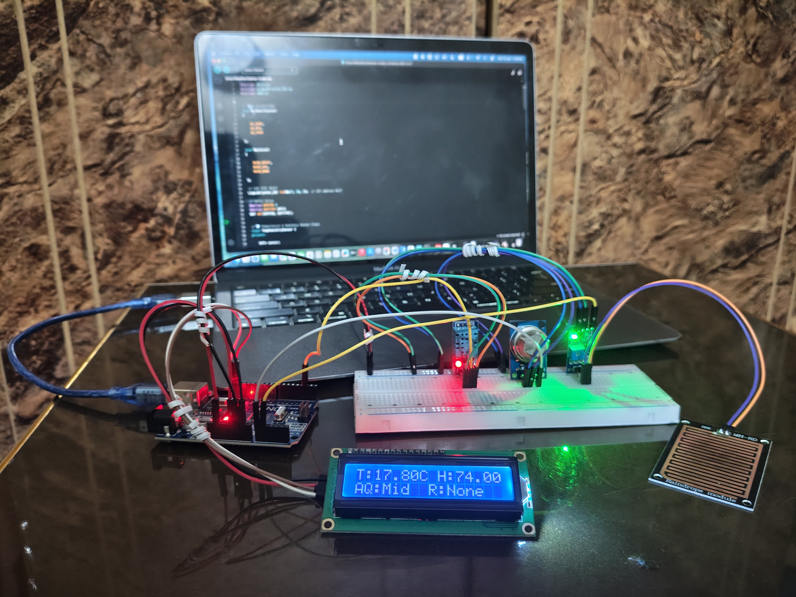

# Object-Oriented Smart Weather Station (C++ / Arduino)

A hardware-software IoT system designed using strict Object-Oriented Programming (OOP) paradigms in C++ to log, structure, and display environmental telemetry data in real time.

## 📸 Live System Showcase

*To see the full functional video walkthrough showing sensor responses to real-world environmental shifts, please watch my live **[Project Demonstration Video on LinkedIn](https://www.linkedin.com/posts/m-waleed-dar-5083a0364_arduino-oop-embeddedsystems-activity-7416025834945249280-06aS?utm_source=share&utm_medium=member_desktop&rcm=ACoAAFp4UNgBTVz_KUik2GHUhKYfqNqQoGA73xQ)**.*

## 🚀 Technical Highlights
- **Encapsulated Architecture:** Developed isolated, modular C++ classes for individual hardware sensors (DHT11, MQ-135, and Rain Sensor) to ensure clean data isolation and protection.
- **State Control:** Implemented clean, scalable conditional logic using custom Enums, reducing controller memory consumption.
- **Data Ingestion Pipeline:** Streamed real-time telemetry into structured CSV layouts, logging outputs straight to external flat-file formats (`.txt`) for spreadsheet evaluation.
- **Low-Level Debugging:** Resolved physical hardware signal constraints and runtime logic bugs to achieve high system stability.

## 🛠️ Components Handled
- **Microcontroller:** Arduino Uno Platform
- **Sensors:** DHT11 (Temperature & Humidity), MQ-135 (Air Quality), Raindrops Module Telemetry
- **Output Interfaces:** 16x2 I2C LCD Display Module, Serial Data Logging Streams

## 📂 Codebase Breakdown
- `src/SmartWeatherStation-Code.ino` -> Contains the encapsulated header logic, class instantiation, and the core algorithmic loop execution.

Minor documentation update.
